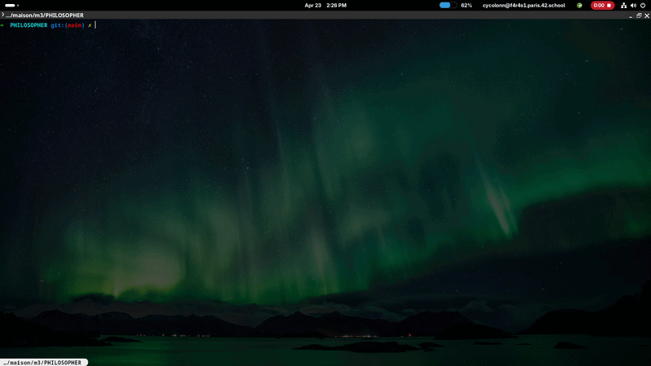

*This project has been created as part of the 42 curriculum by cycolonn.*

# 🍴 Philosophers - Technical Documentation

## 1. Description
**Philosophers** est une introduction aux bases de la programmation multithreadée et de la gestion de la mémoire partagée. Le projet illustre le célèbre problème du **Dîner des Philosophes** d'Edsger Dijkstra, mettant en lumière les défis liés à la synchronisation des threads, aux mutex et à l'évitement des conditions de concurrence (race conditions) et des verrous mortels (deadlocks).

<p align="center">
  
</p>

---

<br />

## 2. Technical Instructions & Features
Le projet a été conçu pour répondre aux exigences strictes du sujet de 42 :

---

<br />

* **Multi-threading**: Chaque philosophe est représenté par un thread indépendant s'exécutant en parallèle.
* **Gestion des Mutex**: Utilisation de `pthread_mutex_t` pour protéger l'accès aux fourchettes et aux variables partagées (statut de la simulation, dernier repas).
* **Surveillance en Temps Réel**: Un thread de monitoring dédié surveille l'état de chaque philosophe pour détecter un décès en moins de 10ms.
* **Évitement de la Famine**: Implémentation de stratégies d'ordonnancement (anti-queue) pour garantir que chaque philosophe puisse manger.
* **Optimisation CPU**: Utilisation de "Smart Sleep" et de délais calculés pour minimiser l'utilisation du processeur sans sacrifier la précision du temps.

---

<br />

## 3. Resources & Technical Choices
Notre implémentation suit des décisions techniques spécifiques pour optimiser la stabilité :

---

<br />

### 🧠 Centralized Memory Management (The `t_data` Structure)
* **Accès Unifié**: Toutes les configurations (temps de mort, manger, dormir) et les mutex de contrôle sont regroupés dans une structure centrale accessible par tous les threads.
* **Protection des Données**: Chaque accès à une variable partagée est systématiquement encapsulé dans un verrouillage de mutex (`stop_mutex`, `meal_mutex`, `print_mutex`).

---

<br />

### ⚖️ Anti-Deadlock Strategy
* **Tri des Fourchettes**: Pour éviter l'interblocage (Circular Wait), les philosophes ramassent leurs fourchettes selon l'adresse mémoire la plus basse en premier.
* **Déphasage des Threads**: Un système de `ft_anti_queue` fait attendre les philosophes avec un ID impair au démarrage pour éviter une saturation immédiate des ressources à T=0.
* **Calcul du Temps de Pensée**: Un temps de pensée dynamique est calculé pour les configurations impaires afin de synchroniser les cycles de repas.

---

<br />

### ⏱️ Time Management & Precision
* **Gettimeofday**: Utilisation de la précision milliseconde pour le suivi du cycle de vie.
* **Attente Passive**: La fonction `ft_waiting` fragmente les temps d'attente en petits intervalles (`usleep`) pour rester réactif aux signaux de fin de simulation tout en économisant le CPU.

---

<br />

### 🛠️ Authorized Functions
Ce projet est construit strictement à l'aide des fonctions système autorisées : `memset`, `printf`, `malloc`, `free`, `write`, `usleep`, `gettimeofday`, `pthread_create`, `pthread_detach`, `pthread_join`, `pthread_mutex_init`, `pthread_mutex_destroy`, `pthread_mutex_lock`, `pthread_mutex_unlock`.

---

<br />

## 📈 How to Compile and Run
Pour compiler et lancer la simulation, utilisez les commandes suivantes :

---

<br />

```bash
# Clone the repo
git clone [https://github.com/Cyril-glitch/philosophers.git](https://github.com/Cyril-glitch/philosophers.git)

# Compile the project
cd philosophers
make

# Run the simulation
# Format: ./philo [nb_philos] [time_to_die] [time_to_eat] [time_to_sleep] [optional: nb_meals]
./philo 199 610 200 200
